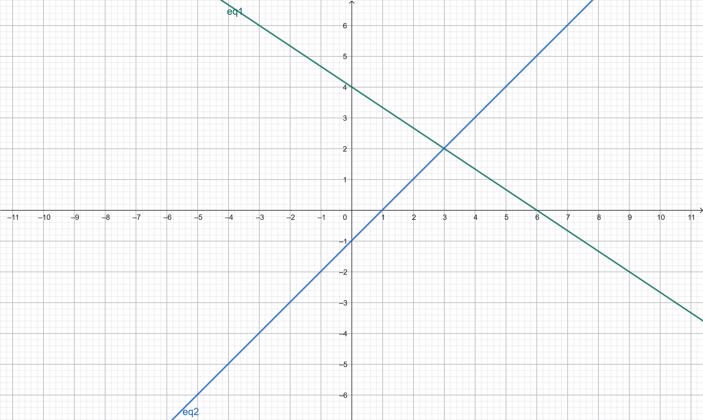

# persamaan linear
# 1. Apa yang dimaksud persaamaan linear
persamaan Linear adalah salah satu persamaan dari ilmu aljabar di mana persamaan ini sukunya mengandung konstanta dengan variabel tunggal

# 2. buat dua persamaan linear dengan dua variable

# Sistem Persamaan Linear
Dalam bab ini kita akan mengembangkan teori yang pada dasarnya lengkap untuk persamaan matematis yang relatif sederhana: yaitu, persamaan linear Sistem persamaan linear adalah himpunan persamaan-persamaan linear yang saling berhubungan untuk membentuk suatu sistem yang bertujuan mencari nilai variabel yang memenuhi seluruh persamaan tersebut

# Sistem Persamaan Linear
### Definition Persamaan Linear
Sebuah **ekspresi** linear dalam $n$ peubah tak diketahui (atau variabel) adalah $x1,x2,...,xn,$ adalah ekspresi berbentuk
$$a1x1+a2x2+...anxn,$$
dengan $a1,a2,...an,$ adalah bilangan real tetap.
Sebuah **persamaan linear** dalam peubah $x1,x2,...,xn,$adalah persamaan yang dapat disederhanakan hanya menggunakan penjumlahan dan pengurangan menjadi bentuk
$$a1x1+a2x2+...+anxn=b,$$
yang kita sebut sebagai **bentuk baku**. Suatu persamaan dalam peubah $x1,x2,...,xn,$ disebut **nonlinear** jika tidak dapat disederhanakan ke bentuk hanya dengan penjumlahan dan pengurangan
Diberikan suatu persamaan linear dalam bentuk baku persamaan tersebut disebut **homogen** jika $b=0$ , dan **nonhomogen** jika $b  .
